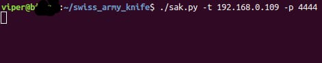
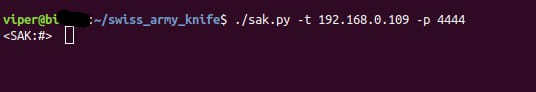
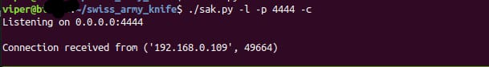

# Swiss Army Knife
Swiss Army Knife (SAK) is a reverse shell
with a small amount of functionalities
like uploading files on the victim machine, or executing Commands directly into the victim's machine.

## Usage
. The SAK uses the client/server model to work.

. The server (victim) is running on the victim machine and set up in listener and initialize a command shell.

. The client (attacker) connect to the server and all the data (commands) that he inputs is executed on the victim machine.

### Example
.Running the SAK in listening mode --> victim pc is listening for incoming connections from all network interfaces.

.Running the SAK in the target mode (client) --> attacker pc connects to the server.

.After pressing CRTL+D the attacker have an **"interactive shell"**.

.Executing commands on the shell (i changed the directory where the SAK was executed on Target mode to see that the commands are executing in the directory that the server mode is).

.Server side when a connection is received.

